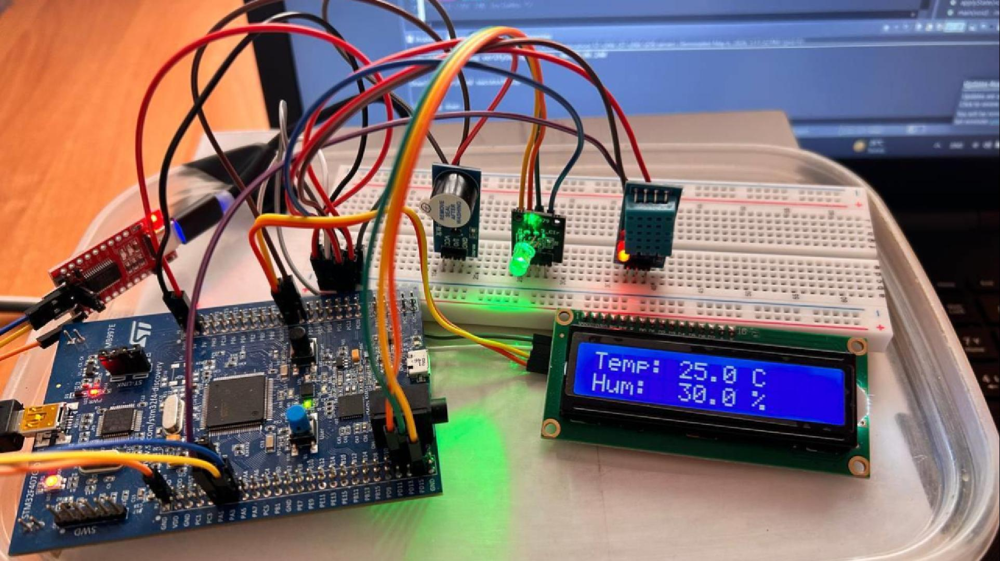

# Weather Station

Система моніторингу температури та вологості на базі STM32F407G-DISC1.

## ⚙️ Компоненти

- STM32F407G-DISC1
- DHT11 (температура + вологість)
- LCD 16x2 I2C
- RGB LED KY-016
- buzzer
- FT232RL (UART-USB)
- mini-USB

## 🔌 Підключення

| Компонент | Вивід STM32 |
|-----------|-------------|
| DHT11 DATA | PA1 |
| LCD SCL | PB6 |
| LCD SDA | PB7 |
| RGB R / G / B | PD14 / PD12 / PD15 |
| Buzzer  | PB5 |
| FT232RL TX / RX | PA3 / PA2 |

## 👩‍💻 Автор

Діана Сюкало, ІО-34
